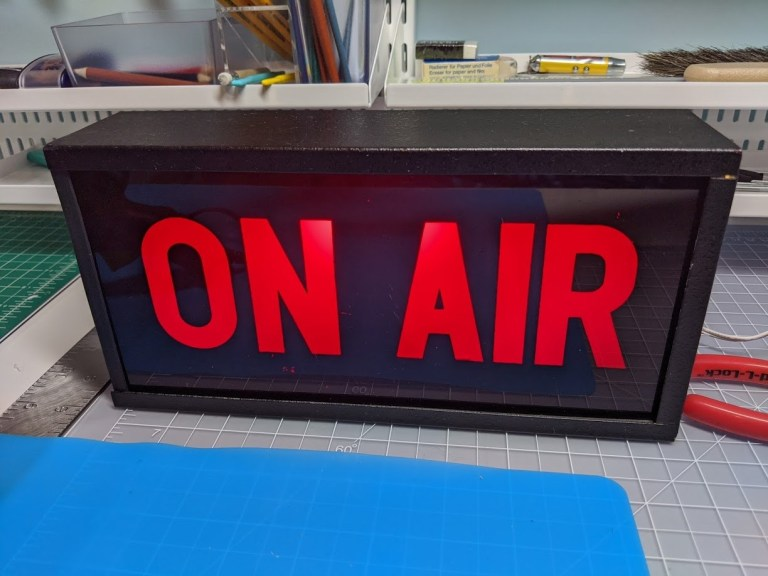

# Track Webcam State with Python and OpenCV

I wanted to track my webcam state, whether or not it is in use, so I could turn on an On Air light. The light's on when my webcam is in use. I use this for my new remote working world. I am in Microsoft Teams and Zoom meetings most of the day.

When this Python script runs, it checks if my webcam is in use or not and updates a ThingSpeak channel with the status. Then, an ESP-8266 Wi-Fi device reads that state from ThingSpeak to control a light.

For more information about my On Air light project:
* https://nothans.com/on-air-light-for-microsoft-teams-and-zoom-meetings
* https://nothans.com/on-air-light-2023

## Setup

* Create ThingSpeak channel at (https://thingspeak.com) with Field 1 enabled
* Change thingSpeakWriteKey to your channel's Write API Key

## Dependencies

* pip install opencv-python
* pip install requests

